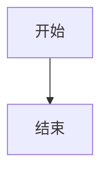

# 📋 文档协议规范 (Document Protocol)

> 本文档定义了项目中所有 Markdown 文件的标准格式和协议规范。

---

## 文档元数据 (Frontmatter)

每个文档必须包含 YAML 格式的元数据头：

```yaml
---
id: document-unique-id          # 文档唯一标识符
title: 文档标题                  # 文档标题
version: 1.0.0                  # 文档版本号
status: draft|review|published  # 文档状态
layer: 1-6|core|plugin          # 所属层级
created: 2024-01-01             # 创建日期
updated: 2024-01-15             # 最后更新日期
author: Author Name             # 作者
tags: [tag1, tag2]              # 标签
---
```

### 状态说明

| 状态 | 说明 |
|------|------|
| `draft` | 草稿，正在编写中 |
| `review` | 审核中，待确认 |
| `published` | 已发布，正式使用 |
| `deprecated` | 已废弃，仅供参考 |

### 层级说明

| 层级 | 说明 |
|------|------|
| `1` | 基础设施层 (Infrastructure) |
| `2` | 代码层 (Code) |
| `3` | 内容层 (Content) |
| `4` | 业务逻辑层 (Business) |
| `5` | 动效层 (Animation) |
| `6` | UI/美术层 (UI Design) |
| `core` | 核心文档 |
| `plugin` | 插件系统 |

---

## 文档结构规范

### 1. 标题层级

```markdown
# 一级标题 - 文档标题（仅一个）

## 二级标题 - 主要章节

### 三级标题 - 子章节

#### 四级标题 - 详细内容（尽量避免更深层级）
```

### 2. 章节顺序

每个层级文档应包含以下章节（按顺序）：

1. **概述** - 层级/功能简介
2. **目录结构** - 文件组织
3. **核心内容** - 主要技术内容
4. **代码示例** - 可复用代码
5. **检查清单** - 完成度追踪
6. **相关文档** - 文档链接

### 3. 代码块规范

```typescript
// 文件路径注释
// src/components/Example.tsx

// 代码内容
export function Example() {
  return <div>Example</div>
}
```

### 4. 表格规范

| 列1 | 列2 | 列3 |
|-----|-----|-----|
| 内容 | 内容 | 内容 |

### 5. 流程图规范

使用 Mermaid 语法：



---

## 命名规范

### 文件命名

| 类型 | 格式 | 示例 |
|------|------|------|
| 层级概述 | `README.md` | `layers/01-infrastructure/README.md` |
| 功能文档 | `FEATURE-NAME.md` | `STATE-MACHINE.md` |
| 子文档 | `feature-name.md` | `page-lifecycle.md` |
| 模板文件 | `name.template.md` | `story.template.md` |
| 预设文件 | `name.preset.md` | `entrance.preset.md` |
| 主题文件 | `name.theme.md` | `ancient-china.theme.md` |

### 目录命名

| 类型 | 格式 | 示例 |
|------|------|------|
| 层级目录 | `NN-name/` | `01-infrastructure/` |
| 功能目录 | `name/` | `flowcharts/` |

---

## 链接规范

### 内部链接

```markdown
<!-- 相对路径 -->
[链接文本](./OTHER-DOC.md)
[链接文本](../other-layer/README.md)

<!-- 锚点链接 -->
[链接文本](#section-id)
```

### 外部链接

```markdown
[Three.js 官网](https://threejs.org)
```

---

## 版本控制

### 版本号规则

遵循语义化版本 (Semantic Versioning)：

- `MAJOR.MINOR.PATCH`
- `1.0.0` → `1.0.1` 修复问题
- `1.0.0` → `1.1.0` 新增内容
- `1.0.0` → `2.0.0` 重大变更

### 变更记录

在文档底部维护变更记录：

```markdown
---

## 变更记录

| 版本 | 日期 | 变更内容 |
|------|------|----------|
| 1.0.0 | 2024-01-01 | 初始版本 |
| 1.1.0 | 2024-01-15 | 新增 XX 章节 |
```

---

## 检查清单格式

```markdown
## ✅ 检查清单

### 分类一
- [ ] 待完成项
- [x] 已完成项

### 分类二
- [ ] 待完成项
```

---

## 文档模板

### 层级 README 模板

```markdown
---
id: layer-N-name
title: Layer N: 层级名称
version: 1.0.0
status: published
layer: N
created: YYYY-MM-DD
updated: YYYY-MM-DD
---

# Layer N: 层级名称 (English Name)

> 一句话描述层级职责

---

## 概述

层级详细说明...

---

## 目录结构

\`\`\`
NN-layer-name/
├── README.md
├── FEATURE-1.md
└── subfolder/
\`\`\`

---

## 核心内容

### 功能一

...

### 功能二

...

---

## 代码示例

\`\`\`typescript
// 示例代码
\`\`\`

---

## ✅ 检查清单

- [ ] 项目一
- [ ] 项目二

---

## 相关文档

- [文档一](./DOC-1.md)
- [文档二](./DOC-2.md)
```

---

## 质量标准

### 内容要求

- [ ] 技术准确性
- [ ] 示例可运行
- [ ] 链接有效
- [ ] 无拼写错误

### 格式要求

- [ ] 符合命名规范
- [ ] 包含元数据
- [ ] 章节完整
- [ ] 代码高亮正确

---

**遵循此协议，确保文档一致性和可维护性。**
