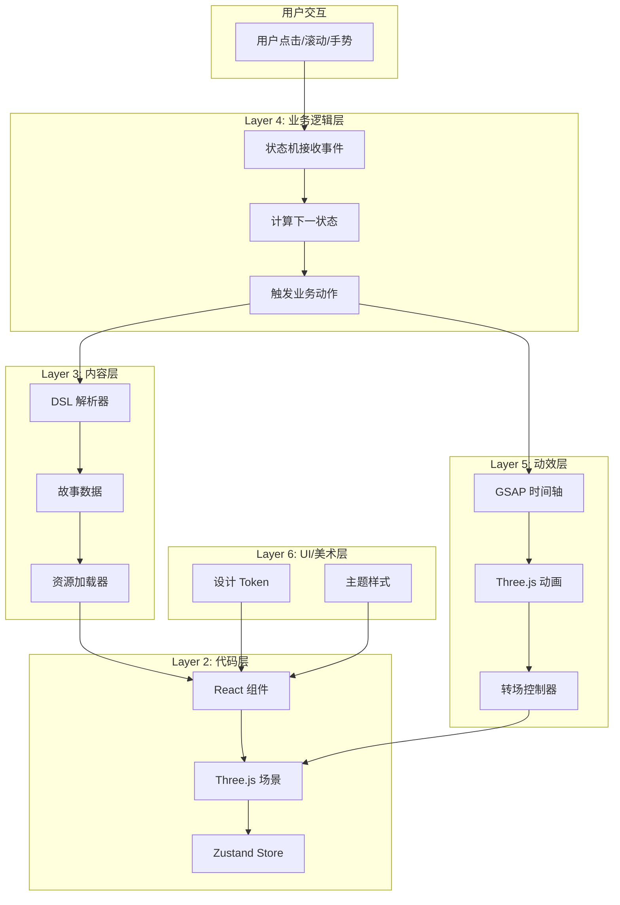

# 历史故事学习展示网站

> 沉浸式 3D 历史学习平台 - Markdown 工程文档

| 属性     | 值                             |
| -------- | ------------------------------ |
| 技术栈   | React + Vite + Three.js + GSAP |
| 可选后端 | NestJS 全栈                    |
| 架构     | 六层解耦 + 插件化扩展          |

---

## 项目愿景

创建一个**沉浸式 3D 历史学习平台**，通过分层架构实现：

```
┌─────────────────────────────────────────────────────────────────────┐
│                    🎬 酷炫历史故事学习展示网站                         │
├─────────────────────────────────────────────────────────────────────┤
│  ✨ 电影级视觉体验    │  📚 模块化内容系统   │  🎨 Figma 设计驱动     │
│  🔄 声明式业务流程    │  🔌 插件化扩展       │  ⚡ 丝滑 GSAP 动效     │
└─────────────────────────────────────────────────────────────────────┘
```

---

## 目录结构

```
web3d-templates/
│
├── README.md                             # 本文件 - 项目入口
├── DOCUMENT-PROTOCOL.md                  # 文档协议规范
│
├── layers/                               # 【六层架构文档】
│   ├── 01-infrastructure/                # Layer 1: 基础设施层
│   │   └── README.md
│   ├── 02-code/                          # Layer 2: 代码层
│   │   └── README.md
│   ├── 03-content/                       # Layer 3: 内容层
│   │   └── README.md
│   ├── 04-business/                      # Layer 4: 业务逻辑层
│   │   ├── README.md
│   │   └── flowcharts/
│   │       └── page-lifecycle.md
│   ├── 05-animation/                     # Layer 5: 动效层
│   │   └── README.md
│   └── 06-ui-design/                     # Layer 6: UI/美术层
│       └── README.md
│
├── history-dsl/                          # 【历史 DSL 系统】
│   ├── README.md
│   ├── syntax/
│   │   ├── DSL-SYNTAX.md
│   │   └── CONTENT-ORGANIZATION.md
│   ├── parser/
│   │   └── PARSER-ARCHITECTURE.md
│   └── examples/
│       └── 01-qin-unification.story.md
│
└── plugins/                              # 【插件系统】
    └── README.md
```

---

## 六层架构概览

```
┌─────────────────────────────────────────────────────────────────────┐
│                        📱 用户界面                                    │
└─────────────────────────────────────────────────────────────────────┘
                                  ↑
┌─────────────────────────────────────────────────────────────────────┐
│  Layer 6: 🎨 UI/美术层                                               │
│  ├── Figma 设计稿 → 设计 Token → 组件样式                             │
│  └── 输入: Figma 文件  输出: CSS Variables / Tailwind Config         │
└─────────────────────────────────────────────────────────────────────┘
                                  ↑
┌─────────────────────────────────────────────────────────────────────┐
│  Layer 5: 🎬 动效层                                                  │
│  ├── GSAP 时间轴 → Three.js 特效 → 转场系统                           │
│  └── 输入: 动效配置  输出: 丝滑动画效果                                │
└─────────────────────────────────────────────────────────────────────┘
                                  ↑
┌─────────────────────────────────────────────────────────────────────┐
│  Layer 4: 🔄 业务逻辑层                                              │
│  ├── 状态机 → 用户流程 → 进度追踪 → 成就系统                           │
│  └── 输入: 用户操作  输出: 状态变化 + 业务事件                         │
└─────────────────────────────────────────────────────────────────────┘
                                  ↑
┌─────────────────────────────────────────────────────────────────────┐
│  Layer 3: 📖 内容层                                                  │
│  ├── 历史故事 DSL → 故事包 → 资源索引                                 │
│  └── 输入: .story.md 文件  输出: 场景配置 JSON                        │
└─────────────────────────────────────────────────────────────────────┘
                                  ↑
┌─────────────────────────────────────────────────────────────────────┐
│  Layer 2: 💻 代码层                                                  │
│  ├── React 组件 → Three.js 场景 → Zustand 状态                       │
│  └── 输入: 配置 JSON  输出: 可渲染组件                                │
└─────────────────────────────────────────────────────────────────────┘
                                  ↑
┌─────────────────────────────────────────────────────────────────────┐
│  Layer 1: 🔧 基础设施层                                              │
│  ├── Vite 构建 → CI/CD → 性能监控                                    │
│  └── 输入: 源代码  输出: 优化的生产构建                                │
└─────────────────────────────────────────────────────────────────────┘
```

---

## 🔗 层间数据流



---

## 📖 各层详细说明

### Layer 1: 基础设施层 (Infrastructure)

| 文档                  | 职责               | 状态   |
| --------------------- | ------------------ | ------ |
| `PROJECT-SCAFFOLD.md` | 项目初始化脚手架   | 待创建 |
| `BUILD-CONFIG.md`     | Vite 构建优化配置  | 待创建 |
| `DEPLOYMENT.md`       | Vercel/Docker 部署 | 待创建 |
| `MONITORING.md`       | 性能监控集成       | 待创建 |

### Layer 2: 代码层 (Code)

| 文档                    | 职责              | 状态      |
| ----------------------- | ----------------- | --------- |
| `README.md`             | 代码层概述        | ✅ 已完成 |
| `REACT-TEMPLATES.md`    | React 组件模板    | 待创建    |
| `THREEJS-COMPONENTS.md` | Three.js 组件封装 | 待创建    |
| `STATE-MANAGEMENT.md`   | Zustand 状态设计  | 待创建    |
| `API-SPECIFICATION.md`  | TypeScript 接口   | 待创建    |

### Layer 3: 内容层 (Content)

| 文档                  | 职责          | 状态   |
| --------------------- | ------------- | ------ |
| `STORY-DSL.md`        | 故事 DSL 语法 | 待创建 |
| `STORY-PACKAGE.md`    | 故事包规范    | 待创建 |
| `ASSET-MANAGEMENT.md` | 资源管理系统  | 待创建 |
| `LOCALIZATION.md`     | 多语言支持    | 待创建 |

### Layer 4: 业务逻辑层 (Business Logic)

| 文档                    | 职责           | 状态   |
| ----------------------- | -------------- | ------ |
| `STATE-MACHINE.md`      | 页面状态机设计 | 待创建 |
| `USER-FLOW.md`          | 用户流程图     | 待创建 |
| `PROGRESS-SYSTEM.md`    | 学习进度系统   | 待创建 |
| `ACHIEVEMENT-SYSTEM.md` | 成就徽章系统   | 待创建 |

### Layer 5: 动效层 (Animation)

| 文档                    | 职责              | 状态   |
| ----------------------- | ----------------- | ------ |
| `GSAP-TEMPLATES.md`     | GSAP 动画模板库   | 待创建 |
| `THREEJS-EFFECTS.md`    | Three.js 视觉特效 | 待创建 |
| `TRANSITIONS.md`        | 页面/场景转场     | 待创建 |
| `MICRO-INTERACTIONS.md` | 微交互动画        | 待创建 |

### Layer 6: UI/美术层 (UI Design)

| 文档                  | 职责               | 状态   |
| --------------------- | ------------------ | ------ |
| `FIGMA-WORKFLOW.md`   | Figma 设计稿工作流 | 待创建 |
| `DESIGN-TOKENS.md`    | 设计 Token 系统    | 待创建 |
| `COMPONENT-SPECS.md`  | 组件视觉规范       | 待创建 |
| `RESPONSIVE-RULES.md` | 响应式适配规则     | 待创建 |

---

## 快速导航

### 我想了解...

| 需求             | 阅读文档                                                       |
| ---------------- | -------------------------------------------------------------- |
| 如何创建历史故事 | [history-dsl/README.md](history-dsl/README.md)                 |
| 代码组件模板     | [layers/02-code/README.md](layers/02-code/README.md)           |
| 动画效果实现     | [layers/05-animation/README.md](layers/05-animation/README.md) |
| Figma 设计对接   | [layers/06-ui-design/README.md](layers/06-ui-design/README.md) |
| 业务流程设计     | [layers/04-business/README.md](layers/04-business/README.md)   |
| 插件开发         | [plugins/README.md](plugins/README.md)                         |

### 我想开发...

| 任务         | 参考文档                           |
| ------------ | ---------------------------------- |
| 新的历史故事 | `history-dsl/syntax/DSL-SYNTAX.md` |
| 新的 3D 组件 | `layers/02-code/README.md`         |
| 新的动画效果 | `layers/05-animation/README.md`    |
| 新的 UI 主题 | `layers/06-ui-design/README.md`    |
| 新的插件     | `plugins/README.md`                |

---

## 检查清单

### 开始新项目时

- [ ] 阅读本文件了解整体结构
- [ ] 根据需求选择相关层级文档深入阅读
- [ ] 参考 `history-dsl/examples/` 中的示例

### 创建新历史故事时

- [ ] 阅读 `history-dsl/syntax/DSL-SYNTAX.md`
- [ ] 参考 `history-dsl/examples/` 中的示例
- [ ] 准备 3D 资源并优化

### 开发新功能时

- [ ] 确定功能属于哪一层
- [ ] 阅读该层的 README.md
- [ ] 遵循 `DOCUMENT-PROTOCOL.md` 文档规范

---

## 技术栈速查

### 前端核心

```json
{
  "react": "^18.2.0",
  "three": "^0.160.0",
  "@react-three/fiber": "^8.15.0",
  "@react-three/drei": "^9.92.0",
  "gsap": "^3.12.0",
  "zustand": "^4.4.0",
  "vite": "^5.0.0",
  "typescript": "^5.3.0"
}
```

### 可选后端 (NestJS)

```json
{
  "@nestjs/core": "^10.0.0",
  "@nestjs/platform-express": "^10.0.0",
  "prisma": "^5.0.0"
}
```

---

## 相关文档

- [DOCUMENT-PROTOCOL.md](DOCUMENT-PROTOCOL.md) - 文档协议规范
- [history-dsl/README.md](history-dsl/README.md) - 历史 DSL 系统
- [plugins/README.md](plugins/README.md) - 插件系统
