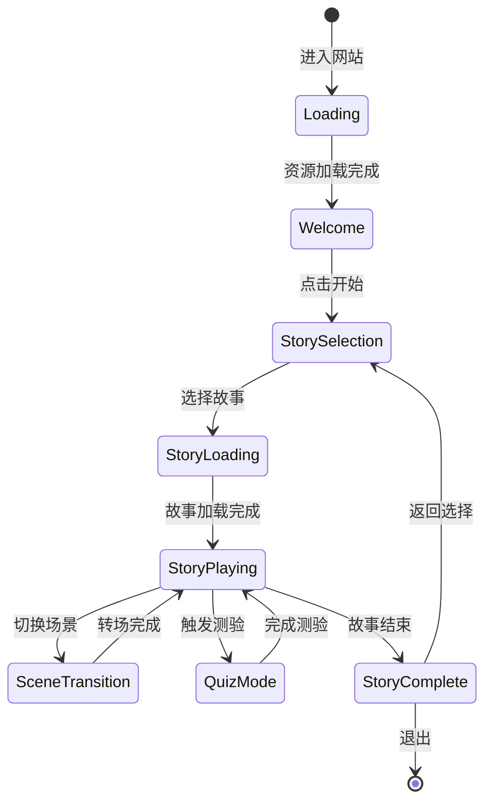
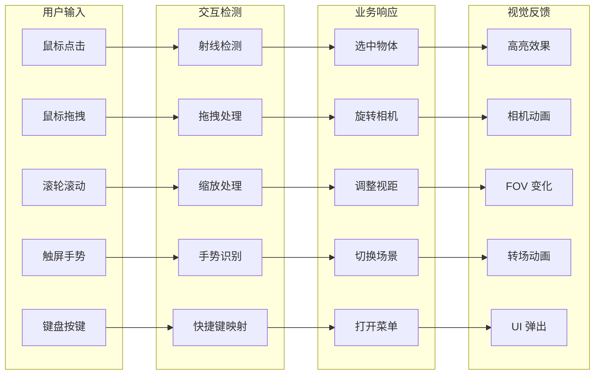
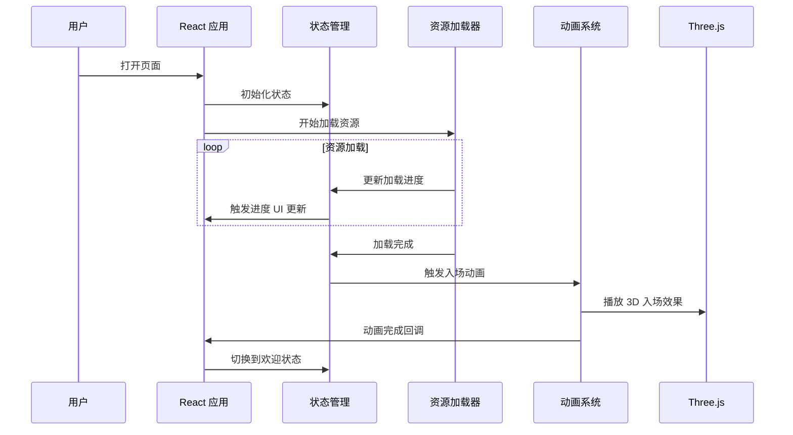
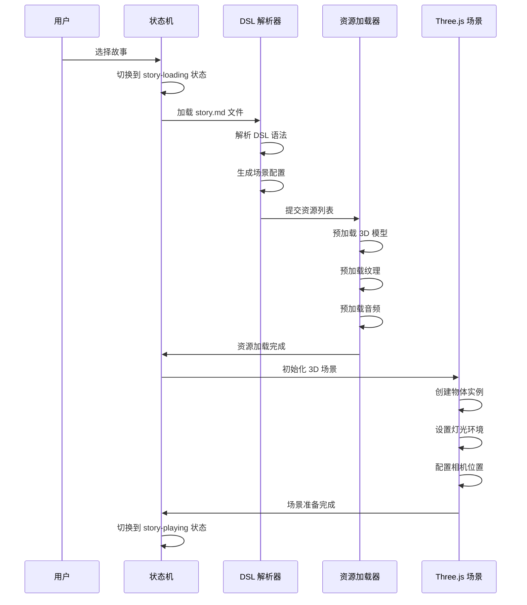
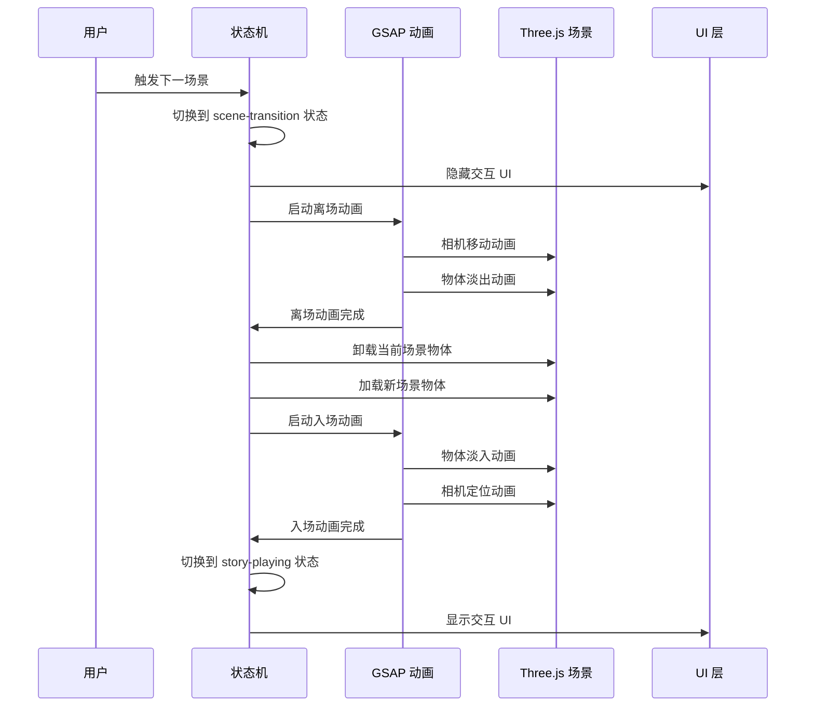

# Layer 4: 业务逻辑层 (Business Logic Layer)

> 定义用户交互流程、页面状态变化和业务规则

---

## 概述

业务逻辑层是连接用户操作和系统响应的桥梁，负责：

1. **页面状态机** - 定义页面的各种状态及转换
2. **用户流程** - 设计用户在网站中的行为路径
3. **进度系统** - 追踪用户学习进度
4. **成就系统** - 激励用户完成学习目标

---

## 目录结构

```
04-business/
├── README.md                 # 本文件
├── STATE-MACHINE.md          # 页面状态机设计
├── USER-FLOW.md              # 用户流程设计
├── PROGRESS-SYSTEM.md        # 进度追踪系统
├── ACHIEVEMENT-SYSTEM.md     # 成就徽章系统
└── flowcharts/               # 流程图
    ├── page-lifecycle.md     # 页面生命周期
    ├── story-navigation.md   # 故事导航流程
    └── interaction-flow.md   # 交互流程
```

---

## 🎬 页面状态机设计

### 主页面状态



### 状态定义

```typescript
// src/types/state.types.ts
export type PageState =
  | 'loading'           // 初始加载
  | 'welcome'           // 欢迎页
  | 'story-selection'   // 故事选择
  | 'story-loading'     // 故事加载
  | 'story-playing'     // 故事播放
  | 'scene-transition'  // 场景切换
  | 'quiz-mode'         // 测验模式
  | 'story-complete'    // 故事完成
  | 'achievement'       // 成就展示

export interface PageStateContext {
  currentState: PageState
  previousState: PageState | null
  storyId: string | null
  sceneIndex: number
  quizId: string | null
  loadProgress: number
}

export type PageEvent =
  | { type: 'LOAD_COMPLETE' }
  | { type: 'START_CLICK' }
  | { type: 'SELECT_STORY'; storyId: string }
  | { type: 'STORY_LOADED' }
  | { type: 'NEXT_SCENE' }
  | { type: 'PREV_SCENE' }
  | { type: 'TRANSITION_COMPLETE' }
  | { type: 'START_QUIZ'; quizId: string }
  | { type: 'COMPLETE_QUIZ'; score: number }
  | { type: 'STORY_END' }
  | { type: 'BACK_TO_SELECTION' }
```

### 状态机实现

```typescript
// src/stores/pageStateMachine.ts
import { create } from 'zustand'

interface PageStateMachine {
  state: PageState
  context: PageStateContext
  send: (event: PageEvent) => void
  canTransition: (event: PageEvent) => boolean
}

const transitions: Record<PageState, Partial<Record<PageEvent['type'], PageState>>> = {
  loading: {
    LOAD_COMPLETE: 'welcome',
  },
  welcome: {
    START_CLICK: 'story-selection',
  },
  'story-selection': {
    SELECT_STORY: 'story-loading',
  },
  'story-loading': {
    STORY_LOADED: 'story-playing',
  },
  'story-playing': {
    NEXT_SCENE: 'scene-transition',
    PREV_SCENE: 'scene-transition',
    START_QUIZ: 'quiz-mode',
    STORY_END: 'story-complete',
  },
  'scene-transition': {
    TRANSITION_COMPLETE: 'story-playing',
  },
  'quiz-mode': {
    COMPLETE_QUIZ: 'story-playing',
  },
  'story-complete': {
    BACK_TO_SELECTION: 'story-selection',
  },
}

export const usePageStateMachine = create<PageStateMachine>((set, get) => ({
  state: 'loading',
  context: {
    currentState: 'loading',
    previousState: null,
    storyId: null,
    sceneIndex: 0,
    quizId: null,
    loadProgress: 0,
  },

  send: (event) => {
    const { state, context } = get()
    const nextState = transitions[state]?.[event.type]

    if (nextState) {
      // 更新上下文
      const newContext = { ...context, previousState: state, currentState: nextState }

      if (event.type === 'SELECT_STORY' && 'storyId' in event) {
        newContext.storyId = event.storyId
        newContext.sceneIndex = 0
      }
      if (event.type === 'NEXT_SCENE') {
        newContext.sceneIndex += 1
      }
      if (event.type === 'PREV_SCENE') {
        newContext.sceneIndex = Math.max(0, newContext.sceneIndex - 1)
      }
      if (event.type === 'START_QUIZ' && 'quizId' in event) {
        newContext.quizId = event.quizId
      }

      set({ state: nextState, context: newContext })

      // 触发状态变化回调
      console.log(`[State] ${state} -> ${nextState}`, event)
    } else {
      console.warn(`[State] Invalid transition: ${state} + ${event.type}`)
    }
  },

  canTransition: (event) => {
    const { state } = get()
    return !!transitions[state]?.[event.type]
  },
}))
```

---

## 🗺️ 用户流程图

### 完整用户旅程

```mermaid
flowchart TD
    A[用户打开网站] --> B{首次访问?}
    B -->|是| C[显示引导动画]
    B -->|否| D[显示欢迎页]
    C --> D

    D --> E[点击"开始探索"]
    E --> F[进入故事选择页]

    F --> G[浏览历史时期]
    G --> H[选择具体故事]

    H --> I[故事加载动画]
    I --> J[进入 3D 场景]

    J --> K{用户操作}
    K -->|点击前进| L[下一场景]
    K -->|点击后退| M[上一场景]
    K -->|点击人物| N[显示人物信息]
    K -->|点击文物| O[显示文物详情]
    K -->|滚动| P[触发时间轴]

    L --> Q{是最后场景?}
    Q -->|否| J
    Q -->|是| R[触发测验]

    M --> J
    N --> J
    O --> J
    P --> J

    R --> S[完成测验]
    S --> T[显示成绩]
    T --> U[获得成就徽章]

    U --> V{继续学习?}
    V -->|是| F
    V -->|否| W[退出/分享]
```

### 场景内交互流程



---

## 📊 页面生命周期

### 进入页面时



### 故事加载流程



### 场景切换流程



---

## 🏆 进度与成就系统

### 进度追踪

```typescript
// src/stores/progressStore.ts
import { create } from 'zustand'
import { persist } from 'zustand/middleware'

interface StoryProgress {
  storyId: string
  completedScenes: number[]
  quizScores: { quizId: string; score: number; completedAt: Date }[]
  totalTime: number // 秒
  lastPlayedAt: Date
  isCompleted: boolean
}

interface ProgressState {
  // 各故事进度
  storyProgress: Record<string, StoryProgress>

  // 总体统计
  totalStoriesCompleted: number
  totalQuizzesPassed: number
  totalLearningTime: number

  // Actions
  updateSceneProgress: (storyId: string, sceneIndex: number) => void
  recordQuizScore: (storyId: string, quizId: string, score: number) => void
  addLearningTime: (storyId: string, seconds: number) => void
  markStoryComplete: (storyId: string) => void
  getStoryProgress: (storyId: string) => StoryProgress | undefined
}

export const useProgressStore = create<ProgressState>()(
  persist(
    (set, get) => ({
      storyProgress: {},
      totalStoriesCompleted: 0,
      totalQuizzesPassed: 0,
      totalLearningTime: 0,

      updateSceneProgress: (storyId, sceneIndex) => {
        set((state) => {
          const existing = state.storyProgress[storyId] || {
            storyId,
            completedScenes: [],
            quizScores: [],
            totalTime: 0,
            lastPlayedAt: new Date(),
            isCompleted: false,
          }

          if (!existing.completedScenes.includes(sceneIndex)) {
            existing.completedScenes.push(sceneIndex)
          }
          existing.lastPlayedAt = new Date()

          return {
            storyProgress: {
              ...state.storyProgress,
              [storyId]: existing,
            },
          }
        })
      },

      recordQuizScore: (storyId, quizId, score) => {
        set((state) => {
          const existing = state.storyProgress[storyId]
          if (!existing) return state

          existing.quizScores.push({
            quizId,
            score,
            completedAt: new Date(),
          })

          const passed = score >= 60
          return {
            storyProgress: {
              ...state.storyProgress,
              [storyId]: existing,
            },
            totalQuizzesPassed: passed
              ? state.totalQuizzesPassed + 1
              : state.totalQuizzesPassed,
          }
        })
      },

      addLearningTime: (storyId, seconds) => {
        set((state) => {
          const existing = state.storyProgress[storyId]
          if (!existing) return state

          existing.totalTime += seconds
          return {
            storyProgress: {
              ...state.storyProgress,
              [storyId]: existing,
            },
            totalLearningTime: state.totalLearningTime + seconds,
          }
        })
      },

      markStoryComplete: (storyId) => {
        set((state) => {
          const existing = state.storyProgress[storyId]
          if (!existing || existing.isCompleted) return state

          existing.isCompleted = true
          return {
            storyProgress: {
              ...state.storyProgress,
              [storyId]: existing,
            },
            totalStoriesCompleted: state.totalStoriesCompleted + 1,
          }
        })
      },

      getStoryProgress: (storyId) => {
        return get().storyProgress[storyId]
      },
    }),
    { name: 'learning-progress' }
  )
)
```

### 成就系统

```typescript
// src/stores/achievementStore.ts
import { create } from 'zustand'
import { persist } from 'zustand/middleware'

interface Achievement {
  id: string
  name: string
  description: string
  icon: string
  rarity: 'common' | 'rare' | 'epic' | 'legendary'
  condition: AchievementCondition
  unlockedAt?: Date
}

type AchievementCondition =
  | { type: 'stories_completed'; count: number }
  | { type: 'quizzes_passed'; count: number }
  | { type: 'learning_time'; minutes: number }
  | { type: 'perfect_quiz'; storyId?: string }
  | { type: 'specific_story'; storyId: string }
  | { type: 'era_mastery'; era: string }

const achievementDefinitions: Achievement[] = [
  {
    id: 'first-story',
    name: '初识历史',
    description: '完成第一个历史故事',
    icon: '📖',
    rarity: 'common',
    condition: { type: 'stories_completed', count: 1 },
  },
  {
    id: 'quiz-master',
    name: '测验达人',
    description: '通过 10 次测验',
    icon: '🎯',
    rarity: 'rare',
    condition: { type: 'quizzes_passed', count: 10 },
  },
  {
    id: 'perfectionist',
    name: '完美主义者',
    description: '在任意测验中获得满分',
    icon: '💯',
    rarity: 'epic',
    condition: { type: 'perfect_quiz' },
  },
  {
    id: 'time-traveler',
    name: '时空旅行者',
    description: '累计学习时间超过 1 小时',
    icon: '⏰',
    rarity: 'rare',
    condition: { type: 'learning_time', minutes: 60 },
  },
  {
    id: 'qin-expert',
    name: '秦朝专家',
    description: '完成所有秦朝相关故事',
    icon: '👑',
    rarity: 'legendary',
    condition: { type: 'era_mastery', era: 'qin' },
  },
]

interface AchievementState {
  achievements: Achievement[]
  unlockedIds: string[]

  checkAndUnlock: (progressState: any) => Achievement | null
  getUnlockedAchievements: () => Achievement[]
  getLockedAchievements: () => Achievement[]
}

export const useAchievementStore = create<AchievementState>()(
  persist(
    (set, get) => ({
      achievements: achievementDefinitions,
      unlockedIds: [],

      checkAndUnlock: (progressState) => {
        const { achievements, unlockedIds } = get()
        const { totalStoriesCompleted, totalQuizzesPassed, totalLearningTime } = progressState

        for (const achievement of achievements) {
          if (unlockedIds.includes(achievement.id)) continue

          let shouldUnlock = false
          const { condition } = achievement

          switch (condition.type) {
            case 'stories_completed':
              shouldUnlock = totalStoriesCompleted >= condition.count
              break
            case 'quizzes_passed':
              shouldUnlock = totalQuizzesPassed >= condition.count
              break
            case 'learning_time':
              shouldUnlock = totalLearningTime >= condition.minutes * 60
              break
            // ... 其他条件
          }

          if (shouldUnlock) {
            achievement.unlockedAt = new Date()
            set({
              unlockedIds: [...unlockedIds, achievement.id],
            })
            return achievement
          }
        }

        return null
      },

      getUnlockedAchievements: () => {
        const { achievements, unlockedIds } = get()
        return achievements.filter((a) => unlockedIds.includes(a.id))
      },

      getLockedAchievements: () => {
        const { achievements, unlockedIds } = get()
        return achievements.filter((a) => !unlockedIds.includes(a.id))
      },
    }),
    { name: 'achievements' }
  )
)
```

---

## ✅ 业务逻辑层检查清单

### 状态机
- [ ] 定义所有页面状态
- [ ] 定义状态转换规则
- [ ] 实现状态机 Store
- [ ] 添加状态变化日志

### 用户流程
- [ ] 绘制完整用户旅程图
- [ ] 定义每个节点的交互
- [ ] 设计异常流程处理
- [ ] 优化关键路径

### 进度系统
- [ ] 实现进度持久化
- [ ] 场景完成追踪
- [ ] 测验成绩记录
- [ ] 学习时间统计

### 成就系统
- [ ] 设计成就列表
- [ ] 实现解锁条件检测
- [ ] 成就展示动画
- [ ] 分享功能

---

## 📚 相关文档

- [STATE-MACHINE.md](./STATE-MACHINE.md) - 状态机详细设计
- [USER-FLOW.md](./USER-FLOW.md) - 用户流程完整文档
- [PROGRESS-SYSTEM.md](./PROGRESS-SYSTEM.md) - 进度系统实现
- [ACHIEVEMENT-SYSTEM.md](./ACHIEVEMENT-SYSTEM.md) - 成就系统设计

---

**业务逻辑层是用户体验的核心，确保流程清晰、状态可控、反馈及时！**
