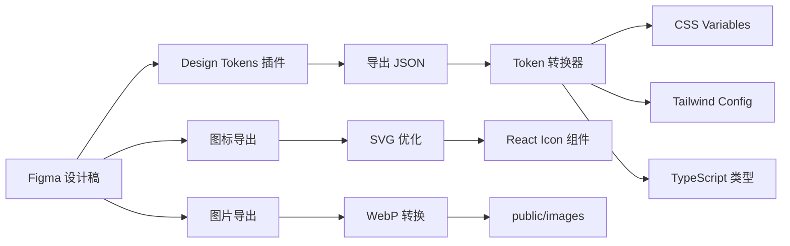

# Layer 6: UI/美术层 (UI Design Layer)

> 定义视觉设计规范，对接 Figma 设计稿，管理设计 Token 系统

---

## 概述

UI/美术层是将设计师的创意转化为代码的桥梁，负责：

1. **Figma 工作流** - 设计稿规范与导出流程
2. **设计 Token** - 可复用的设计变量系统
3. **组件规范** - 组件视觉标准定义
4. **响应式规则** - 多端适配策略

---

## 目录结构

```
06-ui-design/
├── README.md                 # 本文件
├── FIGMA-WORKFLOW.md         # Figma 设计稿工作流
├── DESIGN-TOKENS.md          # 设计 Token 系统
├── COMPONENT-SPECS.md        # 组件视觉规范
├── RESPONSIVE-RULES.md       # 响应式适配规则
└── themes/                   # 主题配置
    ├── ancient-china.theme.md    # 古代中国主题
    ├── modern-museum.theme.md    # 现代博物馆主题
    └── dark-mode.theme.md        # 暗色模式主题
```

---

## 🎨 Figma 设计稿工作流

### 设计稿结构规范

```
📁 历史故事学习平台 (Figma Project)
│
├── 📄 Cover                      # 封面
├── 📄 Design System              # 设计系统
│   ├── Colors                    # 颜色系统
│   ├── Typography                # 字体系统
│   ├── Spacing                   # 间距系统
│   ├── Icons                     # 图标库
│   └── Components                # 组件库
│
├── 📄 Pages                      # 页面设计
│   ├── 00-Loading                # 加载页
│   ├── 01-Welcome                # 欢迎页
│   ├── 02-Story-Selection        # 故事选择
│   ├── 03-Story-Player           # 故事播放
│   ├── 04-Quiz                   # 测验页
│   └── 05-Achievement            # 成就页
│
├── 📄 Components                 # 组件详情
│   ├── Buttons                   # 按钮
│   ├── Cards                     # 卡片
│   ├── Navigation                # 导航
│   ├── Timeline                  # 时间轴
│   ├── Dialog                    # 对话框
│   └── 3D-Overlay                # 3D 叠加层
│
└── 📄 Prototypes                 # 原型交互
    ├── User-Flow                 # 用户流程
    └── Animations                # 动画规范
```

### Figma 命名规范

```
组件命名格式: [类别]/[组件名]/[状态]/[变体]

示例:
- Button/Primary/Default
- Button/Primary/Hover
- Button/Primary/Pressed
- Button/Primary/Disabled

- Card/Story/Normal
- Card/Story/Selected
- Card/Story/Locked

- Icon/Arrow/Right/24px
- Icon/Arrow/Left/24px
```

### 设计稿导出流程



### Figma 插件推荐

| 插件 | 用途 |
|------|------|
| Design Tokens | 导出设计变量 |
| Figma to Code | 生成 CSS/React 代码 |
| SVGO Compressor | SVG 压缩 |
| TinyImage Compressor | 图片压缩 |
| Anima | 导出动画代码 |

---

## 🎨 设计 Token 系统

### Token 结构

```typescript
// src/styles/tokens/index.ts
export const tokens = {
  // 颜色 Token
  colors: {
    // 主色调
    primary: {
      50: '#fff9e6',
      100: '#ffedb3',
      200: '#ffe180',
      300: '#ffd54d',
      400: '#ffc91a',
      500: '#e6b000', // 主色
      600: '#b38900',
      700: '#806200',
      800: '#4d3b00',
      900: '#1a1400',
    },
    // 语义色
    semantic: {
      success: '#22c55e',
      warning: '#f59e0b',
      error: '#ef4444',
      info: '#3b82f6',
    },
    // 中性色
    neutral: {
      0: '#ffffff',
      50: '#fafafa',
      100: '#f4f4f5',
      200: '#e4e4e7',
      300: '#d4d4d8',
      400: '#a1a1aa',
      500: '#71717a',
      600: '#52525b',
      700: '#3f3f46',
      800: '#27272a',
      900: '#18181b',
      1000: '#000000',
    },
    // 历史主题色
    historical: {
      qin: '#8B4513',      // 秦朝 - 青铜色
      han: '#DC143C',      // 汉朝 - 朱红色
      tang: '#FFD700',     // 唐朝 - 金色
      song: '#4682B4',     // 宋朝 - 青瓷蓝
      ming: '#006400',     // 明朝 - 翠绿色
      qing: '#4B0082',     // 清朝 - 靛青色
    },
  },

  // 字体 Token
  typography: {
    fontFamily: {
      primary: '"Noto Serif SC", "Songti SC", serif',
      secondary: '"Noto Sans SC", "PingFang SC", sans-serif',
      mono: '"JetBrains Mono", monospace',
    },
    fontSize: {
      xs: '0.75rem',     // 12px
      sm: '0.875rem',    // 14px
      base: '1rem',      // 16px
      lg: '1.125rem',    // 18px
      xl: '1.25rem',     // 20px
      '2xl': '1.5rem',   // 24px
      '3xl': '1.875rem', // 30px
      '4xl': '2.25rem',  // 36px
      '5xl': '3rem',     // 48px
      '6xl': '3.75rem',  // 60px
    },
    fontWeight: {
      normal: 400,
      medium: 500,
      semibold: 600,
      bold: 700,
    },
    lineHeight: {
      tight: 1.25,
      normal: 1.5,
      relaxed: 1.75,
    },
  },

  // 间距 Token
  spacing: {
    0: '0',
    1: '0.25rem',   // 4px
    2: '0.5rem',    // 8px
    3: '0.75rem',   // 12px
    4: '1rem',      // 16px
    5: '1.25rem',   // 20px
    6: '1.5rem',    // 24px
    8: '2rem',      // 32px
    10: '2.5rem',   // 40px
    12: '3rem',     // 48px
    16: '4rem',     // 64px
    20: '5rem',     // 80px
    24: '6rem',     // 96px
  },

  // 圆角 Token
  borderRadius: {
    none: '0',
    sm: '0.25rem',
    md: '0.5rem',
    lg: '1rem',
    xl: '1.5rem',
    full: '9999px',
  },

  // 阴影 Token
  shadows: {
    sm: '0 1px 2px rgba(0, 0, 0, 0.05)',
    md: '0 4px 6px rgba(0, 0, 0, 0.1)',
    lg: '0 10px 15px rgba(0, 0, 0, 0.1)',
    xl: '0 20px 25px rgba(0, 0, 0, 0.15)',
    glow: '0 0 20px rgba(255, 200, 100, 0.5)',
    inner: 'inset 0 2px 4px rgba(0, 0, 0, 0.1)',
  },

  // 动画 Token
  animation: {
    duration: {
      fast: '150ms',
      normal: '300ms',
      slow: '500ms',
    },
    easing: {
      linear: 'linear',
      easeIn: 'cubic-bezier(0.4, 0, 1, 1)',
      easeOut: 'cubic-bezier(0, 0, 0.2, 1)',
      easeInOut: 'cubic-bezier(0.4, 0, 0.2, 1)',
      bounce: 'cubic-bezier(0.68, -0.55, 0.265, 1.55)',
    },
  },

  // 断点 Token
  breakpoints: {
    sm: '640px',
    md: '768px',
    lg: '1024px',
    xl: '1280px',
    '2xl': '1536px',
  },
}
```

### CSS Variables 生成

```css
/* src/styles/variables.css */
:root {
  /* 主色调 */
  --color-primary-50: #fff9e6;
  --color-primary-100: #ffedb3;
  --color-primary-200: #ffe180;
  --color-primary-300: #ffd54d;
  --color-primary-400: #ffc91a;
  --color-primary-500: #e6b000;
  --color-primary-600: #b38900;
  --color-primary-700: #806200;
  --color-primary-800: #4d3b00;
  --color-primary-900: #1a1400;

  /* 语义色 */
  --color-success: #22c55e;
  --color-warning: #f59e0b;
  --color-error: #ef4444;
  --color-info: #3b82f6;

  /* 中性色 */
  --color-neutral-0: #ffffff;
  --color-neutral-50: #fafafa;
  --color-neutral-100: #f4f4f5;
  --color-neutral-200: #e4e4e7;
  --color-neutral-300: #d4d4d8;
  --color-neutral-400: #a1a1aa;
  --color-neutral-500: #71717a;
  --color-neutral-600: #52525b;
  --color-neutral-700: #3f3f46;
  --color-neutral-800: #27272a;
  --color-neutral-900: #18181b;
  --color-neutral-1000: #000000;

  /* 字体 */
  --font-primary: "Noto Serif SC", "Songti SC", serif;
  --font-secondary: "Noto Sans SC", "PingFang SC", sans-serif;
  --font-mono: "JetBrains Mono", monospace;

  /* 字号 */
  --font-size-xs: 0.75rem;
  --font-size-sm: 0.875rem;
  --font-size-base: 1rem;
  --font-size-lg: 1.125rem;
  --font-size-xl: 1.25rem;
  --font-size-2xl: 1.5rem;
  --font-size-3xl: 1.875rem;
  --font-size-4xl: 2.25rem;

  /* 间距 */
  --spacing-1: 0.25rem;
  --spacing-2: 0.5rem;
  --spacing-3: 0.75rem;
  --spacing-4: 1rem;
  --spacing-6: 1.5rem;
  --spacing-8: 2rem;
  --spacing-12: 3rem;
  --spacing-16: 4rem;

  /* 圆角 */
  --radius-sm: 0.25rem;
  --radius-md: 0.5rem;
  --radius-lg: 1rem;
  --radius-xl: 1.5rem;
  --radius-full: 9999px;

  /* 阴影 */
  --shadow-sm: 0 1px 2px rgba(0, 0, 0, 0.05);
  --shadow-md: 0 4px 6px rgba(0, 0, 0, 0.1);
  --shadow-lg: 0 10px 15px rgba(0, 0, 0, 0.1);
  --shadow-xl: 0 20px 25px rgba(0, 0, 0, 0.15);
  --shadow-glow: 0 0 20px rgba(255, 200, 100, 0.5);

  /* 动画 */
  --duration-fast: 150ms;
  --duration-normal: 300ms;
  --duration-slow: 500ms;
  --easing-default: cubic-bezier(0.4, 0, 0.2, 1);
  --easing-bounce: cubic-bezier(0.68, -0.55, 0.265, 1.55);
}

/* 暗色模式 */
[data-theme="dark"] {
  --color-neutral-0: #18181b;
  --color-neutral-50: #27272a;
  --color-neutral-100: #3f3f46;
  --color-neutral-200: #52525b;
  --color-neutral-300: #71717a;
  --color-neutral-400: #a1a1aa;
  --color-neutral-500: #d4d4d8;
  --color-neutral-600: #e4e4e7;
  --color-neutral-700: #f4f4f5;
  --color-neutral-800: #fafafa;
  --color-neutral-900: #ffffff;
  --color-neutral-1000: #ffffff;
}
```

### Tailwind Config

```javascript
// tailwind.config.js
import { tokens } from './src/styles/tokens'

export default {
  content: ['./index.html', './src/**/*.{js,ts,jsx,tsx}'],
  theme: {
    extend: {
      colors: {
        primary: tokens.colors.primary,
        ...tokens.colors.semantic,
        neutral: tokens.colors.neutral,
        historical: tokens.colors.historical,
      },
      fontFamily: {
        primary: [tokens.typography.fontFamily.primary],
        secondary: [tokens.typography.fontFamily.secondary],
        mono: [tokens.typography.fontFamily.mono],
      },
      fontSize: tokens.typography.fontSize,
      spacing: tokens.spacing,
      borderRadius: tokens.borderRadius,
      boxShadow: tokens.shadows,
      transitionDuration: {
        fast: tokens.animation.duration.fast,
        normal: tokens.animation.duration.normal,
        slow: tokens.animation.duration.slow,
      },
      transitionTimingFunction: {
        'bounce-out': tokens.animation.easing.bounce,
      },
    },
  },
  plugins: [],
}
```

---

## 🧩 组件视觉规范

### 按钮组件

```typescript
// src/components/ui/Button.tsx
import { forwardRef } from 'react'
import { cva, type VariantProps } from 'class-variance-authority'
import { cn } from '@/utils/cn'

const buttonVariants = cva(
  // 基础样式
  'inline-flex items-center justify-center font-medium transition-all duration-normal ease-out rounded-md focus:outline-none focus:ring-2 focus:ring-offset-2 disabled:opacity-50 disabled:pointer-events-none',
  {
    variants: {
      variant: {
        primary: 'bg-primary-500 text-neutral-900 hover:bg-primary-400 focus:ring-primary-500 shadow-md hover:shadow-lg',
        secondary: 'bg-neutral-200 text-neutral-800 hover:bg-neutral-300 focus:ring-neutral-400',
        outline: 'border-2 border-primary-500 text-primary-500 hover:bg-primary-500 hover:text-neutral-900',
        ghost: 'text-neutral-600 hover:bg-neutral-100 hover:text-neutral-900',
        danger: 'bg-error text-white hover:bg-red-600 focus:ring-error',
      },
      size: {
        sm: 'h-8 px-3 text-sm',
        md: 'h-10 px-4 text-base',
        lg: 'h-12 px-6 text-lg',
        xl: 'h-14 px-8 text-xl',
      },
      fullWidth: {
        true: 'w-full',
      },
    },
    defaultVariants: {
      variant: 'primary',
      size: 'md',
    },
  }
)

interface ButtonProps
  extends React.ButtonHTMLAttributes<HTMLButtonElement>,
    VariantProps<typeof buttonVariants> {
  isLoading?: boolean
}

export const Button = forwardRef<HTMLButtonElement, ButtonProps>(
  ({ className, variant, size, fullWidth, isLoading, children, ...props }, ref) => {
    return (
      <button
        ref={ref}
        className={cn(buttonVariants({ variant, size, fullWidth }), className)}
        disabled={isLoading || props.disabled}
        {...props}
      >
        {isLoading ? (
          <>
            <svg className="animate-spin -ml-1 mr-2 h-4 w-4" fill="none" viewBox="0 0 24 24">
              <circle className="opacity-25" cx="12" cy="12" r="10" stroke="currentColor" strokeWidth="4" />
              <path className="opacity-75" fill="currentColor" d="M4 12a8 8 0 018-8V0C5.373 0 0 5.373 0 12h4z" />
            </svg>
            加载中...
          </>
        ) : children}
      </button>
    )
  }
)
```

### 卡片组件

```typescript
// src/components/ui/Card.tsx
import { forwardRef } from 'react'
import { cva, type VariantProps } from 'class-variance-authority'
import { cn } from '@/utils/cn'

const cardVariants = cva(
  'rounded-xl overflow-hidden transition-all duration-normal',
  {
    variants: {
      variant: {
        default: 'bg-neutral-0 border border-neutral-200 shadow-md',
        elevated: 'bg-neutral-0 shadow-xl',
        ghost: 'bg-transparent',
        glass: 'bg-white/10 backdrop-blur-lg border border-white/20',
      },
      interactive: {
        true: 'cursor-pointer hover:shadow-lg hover:scale-[1.02] hover:-translate-y-1',
      },
      padding: {
        none: 'p-0',
        sm: 'p-4',
        md: 'p-6',
        lg: 'p-8',
      },
    },
    defaultVariants: {
      variant: 'default',
      padding: 'md',
    },
  }
)

interface CardProps
  extends React.HTMLAttributes<HTMLDivElement>,
    VariantProps<typeof cardVariants> {}

export const Card = forwardRef<HTMLDivElement, CardProps>(
  ({ className, variant, interactive, padding, ...props }, ref) => {
    return (
      <div
        ref={ref}
        className={cn(cardVariants({ variant, interactive, padding }), className)}
        {...props}
      />
    )
  }
)

// 子组件
export const CardHeader = forwardRef<HTMLDivElement, React.HTMLAttributes<HTMLDivElement>>(
  ({ className, ...props }, ref) => (
    <div ref={ref} className={cn('space-y-1.5', className)} {...props} />
  )
)

export const CardTitle = forwardRef<HTMLHeadingElement, React.HTMLAttributes<HTMLHeadingElement>>(
  ({ className, ...props }, ref) => (
    <h3 ref={ref} className={cn('text-xl font-semibold text-neutral-900', className)} {...props} />
  )
)

export const CardDescription = forwardRef<HTMLParagraphElement, React.HTMLAttributes<HTMLParagraphElement>>(
  ({ className, ...props }, ref) => (
    <p ref={ref} className={cn('text-sm text-neutral-500', className)} {...props} />
  )
)

export const CardContent = forwardRef<HTMLDivElement, React.HTMLAttributes<HTMLDivElement>>(
  ({ className, ...props }, ref) => (
    <div ref={ref} className={cn('', className)} {...props} />
  )
)

export const CardFooter = forwardRef<HTMLDivElement, React.HTMLAttributes<HTMLDivElement>>(
  ({ className, ...props }, ref) => (
    <div ref={ref} className={cn('flex items-center pt-4', className)} {...props} />
  )
)
```

### 故事卡片组件

```typescript
// src/components/story/StoryCard.tsx
import { motion } from 'framer-motion'
import { Card, CardContent } from '../ui/Card'

interface StoryCardProps {
  id: string
  title: string
  era: string
  duration: string
  thumbnail: string
  progress?: number
  isLocked?: boolean
  onClick?: () => void
}

export function StoryCard({
  id,
  title,
  era,
  duration,
  thumbnail,
  progress = 0,
  isLocked = false,
  onClick,
}: StoryCardProps) {
  return (
    <motion.div
      whileHover={{ scale: isLocked ? 1 : 1.05 }}
      whileTap={{ scale: isLocked ? 1 : 0.98 }}
    >
      <Card
        interactive={!isLocked}
        variant="elevated"
        padding="none"
        className={`relative group ${isLocked ? 'grayscale opacity-60' : ''}`}
        onClick={isLocked ? undefined : onClick}
      >
        {/* 封面图 */}
        <div className="relative aspect-[16/9] overflow-hidden">
          
          {/* 渐变遮罩 */}
          <div className="absolute inset-0 bg-gradient-to-t from-black/80 via-transparent to-transparent" />

          {/* 时代标签 */}
          <span className="absolute top-3 left-3 px-2 py-1 text-xs font-medium bg-primary-500/90 text-neutral-900 rounded-md">
            {era}
          </span>

          {/* 锁定图标 */}
          {isLocked && (
            <div className="absolute inset-0 flex items-center justify-center bg-black/40">
              <svg className="w-12 h-12 text-white/80" fill="currentColor" viewBox="0 0 24 24">
                <path d="M12 1a5 5 0 00-5 5v4H5a2 2 0 00-2 2v10a2 2 0 002 2h14a2 2 0 002-2V12a2 2 0 00-2-2h-2V6a5 5 0 00-5-5zm3 9H9V6a3 3 0 116 0v4z" />
              </svg>
            </div>
          )}
        </div>

        {/* 内容区 */}
        <CardContent className="p-4">
          <h3 className="font-semibold text-lg text-neutral-900 group-hover:text-primary-600 transition-colors">
            {title}
          </h3>
          <div className="flex items-center justify-between mt-2 text-sm text-neutral-500">
            <span>{duration}</span>
            {progress > 0 && !isLocked && (
              <span className="text-primary-600">{progress}% 完成</span>
            )}
          </div>

          {/* 进度条 */}
          {progress > 0 && !isLocked && (
            <div className="mt-3 h-1 bg-neutral-200 rounded-full overflow-hidden">
              <div
                className="h-full bg-primary-500 rounded-full transition-all duration-slow"
                style={{ width: `${progress}%` }}
              />
            </div>
          )}
        </CardContent>
      </Card>
    </motion.div>
  )
}
```

---

## 📱 响应式规则

### 断点系统

```css
/* 响应式断点 */
/* sm: 640px - 手机横屏 */
/* md: 768px - 平板竖屏 */
/* lg: 1024px - 平板横屏/小笔记本 */
/* xl: 1280px - 笔记本 */
/* 2xl: 1536px - 桌面显示器 */
```

### 响应式布局组件

```typescript
// src/components/layout/ResponsiveLayout.tsx
import { useMediaQuery } from '@/hooks/useMediaQuery'

interface ResponsiveLayoutProps {
  children: React.ReactNode
}

export function ResponsiveLayout({ children }: ResponsiveLayoutProps) {
  const isMobile = useMediaQuery('(max-width: 767px)')
  const isTablet = useMediaQuery('(min-width: 768px) and (max-width: 1023px)')
  const isDesktop = useMediaQuery('(min-width: 1024px)')

  return (
    <div
      className={`
        min-h-screen
        ${isMobile ? 'px-4' : ''}
        ${isTablet ? 'px-6' : ''}
        ${isDesktop ? 'px-8 max-w-7xl mx-auto' : ''}
      `}
    >
      {children}
    </div>
  )
}

// useMediaQuery Hook
export function useMediaQuery(query: string): boolean {
  const [matches, setMatches] = useState(false)

  useEffect(() => {
    const media = window.matchMedia(query)
    setMatches(media.matches)

    const listener = (e: MediaQueryListEvent) => setMatches(e.matches)
    media.addEventListener('change', listener)
    return () => media.removeEventListener('change', listener)
  }, [query])

  return matches
}
```

### 3D Canvas 响应式

```typescript
// src/components/canvas/ResponsiveCanvas.tsx
import { Canvas } from '@react-three/fiber'
import { useMediaQuery } from '@/hooks/useMediaQuery'

interface ResponsiveCanvasProps {
  children: React.ReactNode
}

export function ResponsiveCanvas({ children }: ResponsiveCanvasProps) {
  const isMobile = useMediaQuery('(max-width: 767px)')

  const canvasConfig = {
    dpr: isMobile ? [1, 1.5] : [1, 2],
    gl: {
      antialias: !isMobile,
      powerPreference: isMobile ? 'low-power' : 'high-performance',
    },
    camera: {
      fov: isMobile ? 60 : 50, // 移动端视野更广
    },
  }

  return (
    <Canvas {...canvasConfig}>
      {children}
    </Canvas>
  )
}
```

---

## 🌙 主题系统

### 主题 Provider

```typescript
// src/contexts/ThemeContext.tsx
import { createContext, useContext, useState, useEffect } from 'react'

type Theme = 'light' | 'dark' | 'ancient-china' | 'modern-museum'

interface ThemeContextValue {
  theme: Theme
  setTheme: (theme: Theme) => void
  toggleDarkMode: () => void
}

const ThemeContext = createContext<ThemeContextValue | null>(null)

export function ThemeProvider({ children }: { children: React.ReactNode }) {
  const [theme, setTheme] = useState<Theme>('light')

  useEffect(() => {
    // 读取系统偏好
    const prefersDark = window.matchMedia('(prefers-color-scheme: dark)').matches
    const savedTheme = localStorage.getItem('theme') as Theme
    setTheme(savedTheme || (prefersDark ? 'dark' : 'light'))
  }, [])

  useEffect(() => {
    document.documentElement.setAttribute('data-theme', theme)
    localStorage.setItem('theme', theme)
  }, [theme])

  const toggleDarkMode = () => {
    setTheme(prev => prev === 'dark' ? 'light' : 'dark')
  }

  return (
    <ThemeContext.Provider value={{ theme, setTheme, toggleDarkMode }}>
      {children}
    </ThemeContext.Provider>
  )
}

export const useTheme = () => {
  const context = useContext(ThemeContext)
  if (!context) throw new Error('useTheme must be used within ThemeProvider')
  return context
}
```

### 古代中国主题

```css
/* themes/ancient-china.css */
[data-theme="ancient-china"] {
  /* 主色调 - 古铜金 */
  --color-primary-500: #8B4513;
  --color-primary-400: #A0522D;
  --color-primary-600: #6B3410;

  /* 背景 - 宣纸色 */
  --color-neutral-0: #F5F5DC;
  --color-neutral-50: #EEE8D5;
  --color-neutral-100: #E5DCC3;

  /* 强调色 - 朱砂红 */
  --color-accent: #8B0000;

  /* 字体 - 衬线体 */
  --font-primary: "Noto Serif SC", "Songti SC", serif;

  /* 装饰元素 */
  --border-ornament: url('/images/chinese-border.svg');
  --bg-pattern: url('/images/chinese-pattern.svg');
}
```

---

## ✅ UI/美术层检查清单

### Figma 工作流
- [ ] 设计系统页面完成
- [ ] 组件库建立
- [ ] 命名规范统一
- [ ] 导出流程自动化

### 设计 Token
- [ ] 颜色系统定义
- [ ] 字体系统定义
- [ ] 间距系统定义
- [ ] 阴影/圆角定义
- [ ] CSS Variables 生成
- [ ] Tailwind 配置同步

### 组件规范
- [ ] 按钮组件所有状态
- [ ] 卡片组件所有变体
- [ ] 表单组件规范
- [ ] 导航组件规范
- [ ] 弹窗组件规范

### 响应式
- [ ] 移动端适配
- [ ] 平板适配
- [ ] 桌面端适配
- [ ] 触摸/鼠标交互区分

### 主题
- [ ] 亮色主题
- [ ] 暗色主题
- [ ] 历史主题
- [ ] 主题切换动画

---

## 📚 相关文档

- [FIGMA-WORKFLOW.md](./FIGMA-WORKFLOW.md) - Figma 完整工作流
- [DESIGN-TOKENS.md](./DESIGN-TOKENS.md) - 设计 Token 详解
- [COMPONENT-SPECS.md](./COMPONENT-SPECS.md) - 组件规范文档
- [RESPONSIVE-RULES.md](./RESPONSIVE-RULES.md) - 响应式规则

---

**UI/美术层是将设计愿景转化为代码的关键，确保视觉一致、体验优秀！**
