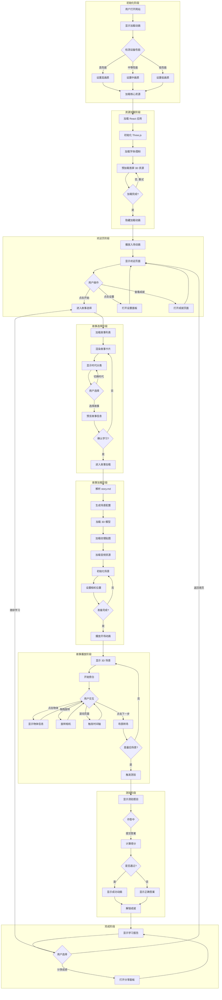
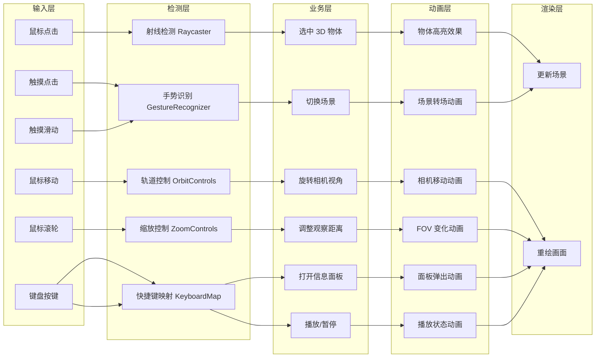
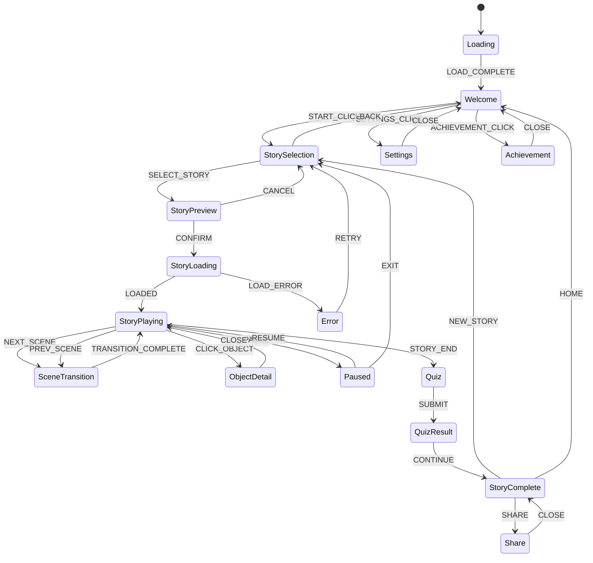
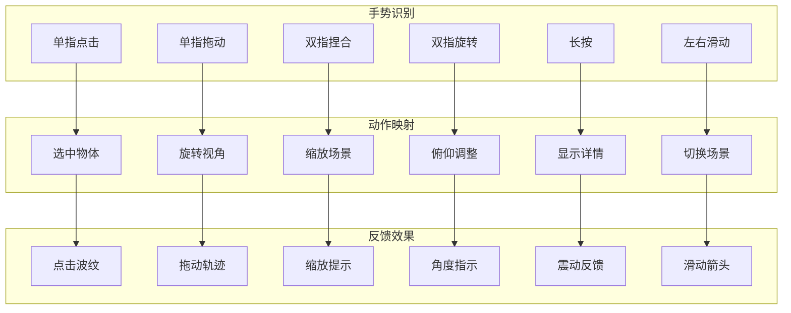
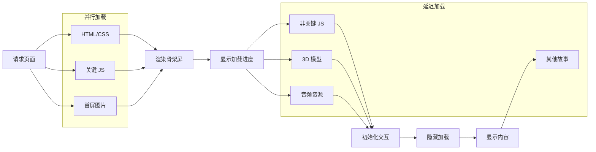
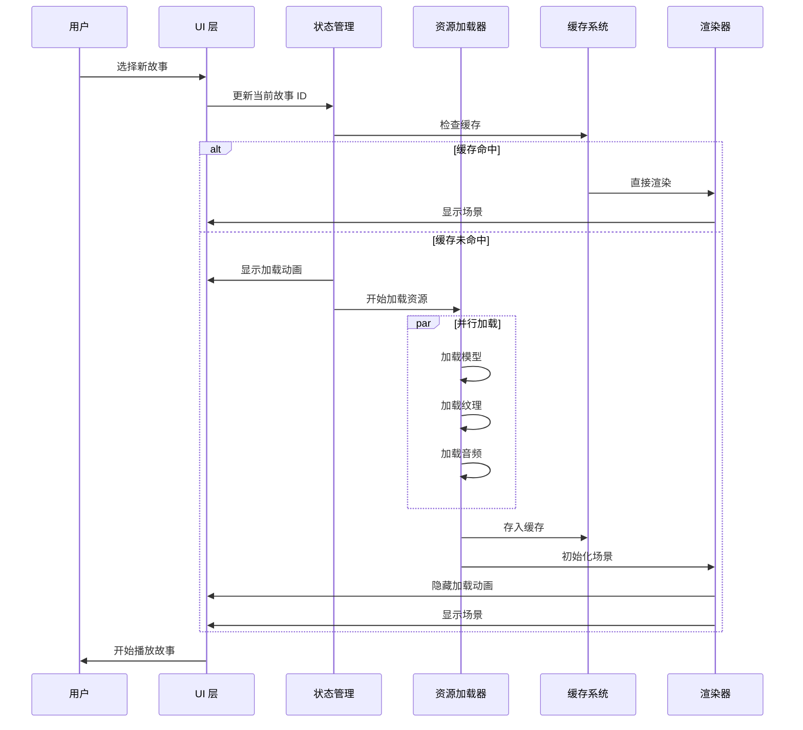

# 页面生命周期流程图

> 定义用户从进入网站到完成学习的完整页面生命周期

---

## 概述

本文档使用 Mermaid 流程图详细描述页面各阶段的状态变化和数据流。

---

## 完整页面生命周期

---

## 🎬 场景内交互流程

---

## 🔄 状态转换矩阵

---

## 📱 移动端手势流程

---

## 🎯 关键路径优化

### 首屏加载优化路径

### 故事切换优化路径

---

## ✅ 流程图检查清单

- [ ] 页面生命周期完整定义
- [ ] 所有状态转换已覆盖
- [ ] 异常路径已处理
- [ ] 移动端手势已适配
- [ ] 性能优化路径已规划

---

**流程图是业务逻辑的蓝图，确保每个状态转换都有据可依！**
