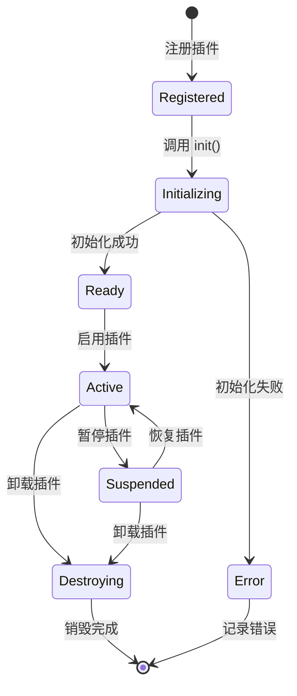

# 插件系统

> 历史故事学习平台的插件化扩展系统

---

## 系统概述

插件系统允许开发者扩展平台功能，实现：

1. **功能扩展** - 添加新的交互方式、展示形式
2. **内容增强** - 扩展故事内容类型
3. **第三方集成** - 对接外部服务和工具
4. **定制化** - 满足特定用户需求

---

## 📁 目录结构

```
plugins/
├── README.md                 # 本文件
├── PLUGIN-API.md             # 插件 API 文档
├── PLUGIN-TEMPLATE.md        # 插件开发模板
└── catalog/                  # 官方插件目录
    ├── vr-support.plugin.md       # VR 支持插件
    ├── ai-narrator.plugin.md      # AI 语音合成插件
    ├── quiz-engine.plugin.md      # 测验引擎插件
    ├── share-social.plugin.md     # 社交分享插件
    └── analytics.plugin.md        # 数据分析插件
```

---

## 🧩 插件架构

### 核心架构图

```
┌─────────────────────────────────────────────────────────────────┐
│                        历史学习平台                               │
├─────────────────────────────────────────────────────────────────┤
│                                                                 │
│   ┌─────────────────────────────────────────────────────────┐   │
│   │                    插件管理器 (PluginManager)             │   │
│   ├─────────────────────────────────────────────────────────┤   │
│   │  ┌─────────┐  ┌─────────┐  ┌─────────┐  ┌─────────┐    │   │
│   │  │ 加载器  │  │ 注册器  │  │ 生命周期 │  │ 通信总线 │    │   │
│   │  └─────────┘  └─────────┘  └─────────┘  └─────────┘    │   │
│   └─────────────────────────────────────────────────────────┘   │
│                              ↓                                  │
│   ┌─────────────────────────────────────────────────────────┐   │
│   │                    插件 API 层 (Plugin API)               │   │
│   ├─────────────────────────────────────────────────────────┤   │
│   │  ┌──────┐  ┌──────┐  ┌──────┐  ┌──────┐  ┌──────┐      │   │
│   │  │Scene │  │Story │  │ UI   │  │Audio │  │Events│      │   │
│   │  │ API  │  │ API  │  │ API  │  │ API  │  │ API  │      │   │
│   │  └──────┘  └──────┘  └──────┘  └──────┘  └──────┘      │   │
│   └─────────────────────────────────────────────────────────┘   │
│                              ↓                                  │
│   ┌─────────────────────────────────────────────────────────┐   │
│   │                    已安装插件                             │   │
│   ├─────────┬─────────┬─────────┬─────────┬─────────────────┤   │
│   │   VR    │   AI    │  Quiz   │  Share  │   Analytics     │   │
│   │ Support │Narrator │ Engine  │ Social  │                 │   │
│   └─────────┴─────────┴─────────┴─────────┴─────────────────┘   │
│                                                                 │
└─────────────────────────────────────────────────────────────────┘
```

### 插件生命周期



---

## 🔧 插件 API

### 核心接口定义

```typescript
// src/plugins/types.ts

/**
 * 插件元数据
 */
interface PluginMeta {
  id: string // 唯一标识符
  name: string // 插件名称
  version: string // 版本号
  description: string // 描述
  author: {
    name: string
    email?: string
    url?: string
  }
  license: string // 许可证
  homepage?: string // 主页
  repository?: string // 仓库地址
  keywords: string[] // 关键词
  dependencies?: Record<string, string> // 依赖
  peerDependencies?: Record<string, string> // 对等依赖
}

/**
 * 插件配置
 */
interface PluginConfig {
  enabled: boolean // 是否启用
  settings: Record<string, any> // 自定义设置
}

/**
 * 插件上下文
 */
interface PluginContext {
  // 场景 API
  scene: {
    getCamera: () => THREE.Camera
    getScene: () => THREE.Scene
    getRenderer: () => THREE.WebGLRenderer
    addObject: (object: THREE.Object3D) => void
    removeObject: (object: THREE.Object3D) => void
    raycast: (position: { x: number; y: number }) => THREE.Intersection[]
  }

  // 故事 API
  story: {
    getCurrentStory: () => Story | null
    getCurrentScene: () => Scene | null
    getProgress: () => number
    navigateTo: (sceneId: string) => void
    pause: () => void
    resume: () => void
  }

  // UI API
  ui: {
    showNotification: (message: string, type?: 'info' | 'success' | 'warning' | 'error') => void
    showModal: (config: ModalConfig) => Promise<any>
    addMenuItem: (item: MenuItem) => void
    removeMenuItem: (id: string) => void
    registerPanel: (panel: PanelConfig) => void
  }

  // 音频 API
  audio: {
    play: (url: string, options?: AudioOptions) => AudioInstance
    stop: (id: string) => void
    setVolume: (volume: number) => void
    getAnalyser: () => AnalyserNode | null
  }

  // 事件 API
  events: {
    on: (event: string, handler: EventHandler) => void
    off: (event: string, handler: EventHandler) => void
    emit: (event: string, data?: any) => void
  }

  // 存储 API
  storage: {
    get: <T>(key: string) => T | null
    set: <T>(key: string, value: T) => void
    remove: (key: string) => void
    clear: () => void
  }

  // 配置
  config: PluginConfig
}

/**
 * 插件定义
 */
interface PluginDefinition {
  meta: PluginMeta

  // 生命周期钩子
  onInit?: (context: PluginContext) => Promise<void> | void
  onActivate?: (context: PluginContext) => Promise<void> | void
  onDeactivate?: (context: PluginContext) => Promise<void> | void
  onDestroy?: (context: PluginContext) => Promise<void> | void

  // 事件钩子
  onStoryLoad?: (story: Story, context: PluginContext) => void
  onSceneEnter?: (scene: Scene, context: PluginContext) => void
  onSceneExit?: (scene: Scene, context: PluginContext) => void
  onObjectClick?: (object: THREE.Object3D, context: PluginContext) => void
  onQuizComplete?: (result: QuizResult, context: PluginContext) => void

  // 渲染钩子
  renderOverlay?: (context: PluginContext) => React.ReactNode
  renderPanel?: (context: PluginContext) => React.ReactNode

  // 配置界面
  renderSettings?: (context: PluginContext) => React.ReactNode
}
```

### 插件管理器

```typescript
// src/plugins/PluginManager.ts

class PluginManager {
  private plugins: Map<string, PluginInstance> = new Map()
  private context: PluginContext

  constructor(context: PluginContext) {
    this.context = context
  }

  /**
   * 注册插件
   */
  async register(plugin: PluginDefinition): Promise<void> {
    const { id, version } = plugin.meta

    if (this.plugins.has(id)) {
      throw new Error(`Plugin ${id} is already registered`)
    }

    // 检查依赖
    await this.checkDependencies(plugin.meta.dependencies || {})

    // 创建插件实例
    const instance: PluginInstance = {
      definition: plugin,
      state: 'registered',
      config: {
        enabled: true,
        settings: {},
      },
    }

    this.plugins.set(id, instance)
    console.log(`[PluginManager] Registered plugin: ${id}@${version}`)
  }

  /**
   * 初始化插件
   */
  async init(pluginId: string): Promise<void> {
    const instance = this.plugins.get(pluginId)
    if (!instance) throw new Error(`Plugin ${pluginId} not found`)

    try {
      instance.state = 'initializing'
      await instance.definition.onInit?.(this.context)
      instance.state = 'ready'
      console.log(`[PluginManager] Initialized plugin: ${pluginId}`)
    } catch (error) {
      instance.state = 'error'
      console.error(`[PluginManager] Failed to init plugin: ${pluginId}`, error)
      throw error
    }
  }

  /**
   * 启用插件
   */
  async activate(pluginId: string): Promise<void> {
    const instance = this.plugins.get(pluginId)
    if (!instance) throw new Error(`Plugin ${pluginId} not found`)
    if (instance.state !== 'ready' && instance.state !== 'suspended') {
      throw new Error(`Plugin ${pluginId} cannot be activated from state: ${instance.state}`)
    }

    await instance.definition.onActivate?.(this.context)
    instance.state = 'active'
    instance.config.enabled = true

    // 绑定事件钩子
    this.bindEventHooks(instance)

    console.log(`[PluginManager] Activated plugin: ${pluginId}`)
  }

  /**
   * 停用插件
   */
  async deactivate(pluginId: string): Promise<void> {
    const instance = this.plugins.get(pluginId)
    if (!instance) throw new Error(`Plugin ${pluginId} not found`)
    if (instance.state !== 'active') return

    await instance.definition.onDeactivate?.(this.context)
    instance.state = 'suspended'
    instance.config.enabled = false

    // 解绑事件钩子
    this.unbindEventHooks(instance)

    console.log(`[PluginManager] Deactivated plugin: ${pluginId}`)
  }

  /**
   * 卸载插件
   */
  async unregister(pluginId: string): Promise<void> {
    const instance = this.plugins.get(pluginId)
    if (!instance) return

    if (instance.state === 'active') {
      await this.deactivate(pluginId)
    }

    await instance.definition.onDestroy?.(this.context)
    this.plugins.delete(pluginId)

    console.log(`[PluginManager] Unregistered plugin: ${pluginId}`)
  }

  /**
   * 获取已安装插件列表
   */
  getPlugins(): PluginInfo[] {
    return Array.from(this.plugins.values()).map((instance) => ({
      ...instance.definition.meta,
      state: instance.state,
      enabled: instance.config.enabled,
    }))
  }

  /**
   * 获取插件配置
   */
  getConfig(pluginId: string): PluginConfig | null {
    return this.plugins.get(pluginId)?.config || null
  }

  /**
   * 更新插件配置
   */
  setConfig(pluginId: string, config: Partial<PluginConfig>): void {
    const instance = this.plugins.get(pluginId)
    if (instance) {
      instance.config = { ...instance.config, ...config }
    }
  }

  // 私有方法
  private async checkDependencies(deps: Record<string, string>): Promise<void> {
    for (const [depId, version] of Object.entries(deps)) {
      const dep = this.plugins.get(depId)
      if (!dep) {
        throw new Error(`Missing dependency: ${depId}@${version}`)
      }
      // TODO: 版本检查
    }
  }

  private bindEventHooks(instance: PluginInstance): void {
    const { definition } = instance
    const { events } = this.context

    if (definition.onStoryLoad) {
      events.on('story:load', definition.onStoryLoad)
    }
    if (definition.onSceneEnter) {
      events.on('scene:enter', definition.onSceneEnter)
    }
    if (definition.onSceneExit) {
      events.on('scene:exit', definition.onSceneExit)
    }
    if (definition.onObjectClick) {
      events.on('object:click', definition.onObjectClick)
    }
    if (definition.onQuizComplete) {
      events.on('quiz:complete', definition.onQuizComplete)
    }
  }

  private unbindEventHooks(instance: PluginInstance): void {
    const { definition } = instance
    const { events } = this.context

    if (definition.onStoryLoad) {
      events.off('story:load', definition.onStoryLoad)
    }
    if (definition.onSceneEnter) {
      events.off('scene:enter', definition.onSceneEnter)
    }
    if (definition.onSceneExit) {
      events.off('scene:exit', definition.onSceneExit)
    }
    if (definition.onObjectClick) {
      events.off('object:click', definition.onObjectClick)
    }
    if (definition.onQuizComplete) {
      events.off('quiz:complete', definition.onQuizComplete)
    }
  }
}
```

---

## 📦 官方插件

### 1. VR 支持插件

```typescript
// plugins/vr-support/index.ts

const VRSupportPlugin: PluginDefinition = {
  meta: {
    id: 'vr-support',
    name: 'VR 支持',
    version: '1.0.0',
    description: '为历史场景添加 VR 沉浸式体验',
    author: { name: 'History3D Team' },
    license: 'MIT',
    keywords: ['vr', 'webxr', 'immersive'],
  },

  onInit: async (context) => {
    // 检测 WebXR 支持
    if (!navigator.xr) {
      console.warn('[VR] WebXR not supported')
      return
    }

    const isVRSupported = await navigator.xr.isSessionSupported('immersive-vr')
    if (!isVRSupported) {
      console.warn('[VR] Immersive VR not supported')
      return
    }

    console.log('[VR] VR support initialized')
  },

  onActivate: (context) => {
    // 添加 VR 按钮到 UI
    context.ui.addMenuItem({
      id: 'vr-enter',
      label: '进入 VR 模式',
      icon: 'vr-headset',
      onClick: () => enterVR(context),
    })
  },

  onDeactivate: (context) => {
    context.ui.removeMenuItem('vr-enter')
  },

  renderOverlay: (context) => {
    // VR 模式下的 HUD
    return <VROverlay context={context} />
  },

  renderSettings: (context) => {
    return (
      <div>
        <h3>VR 设置</h3>
        <label>
          <input type="checkbox" /> 启用手部追踪
        </label>
        <label>
          <input type="checkbox" /> 启用语音交互
        </label>
      </div>
    )
  },
}

async function enterVR(context: PluginContext) {
  const session = await navigator.xr!.requestSession('immersive-vr', {
    requiredFeatures: ['local-floor'],
    optionalFeatures: ['hand-tracking'],
  })

  const renderer = context.scene.getRenderer()
  renderer.xr.enabled = true
  renderer.xr.setSession(session)

  context.events.emit('vr:enter')
}
```

### 2. AI 语音合成插件

```typescript
// plugins/ai-narrator/index.ts

const AINarratorPlugin: PluginDefinition = {
  meta: {
    id: 'ai-narrator',
    name: 'AI 语音合成',
    version: '1.0.0',
    description: '使用 AI 为历史旁白生成语音',
    author: { name: 'History3D Team' },
    license: 'MIT',
    keywords: ['ai', 'tts', 'voice', 'narrator'],
  },

  onInit: async (context) => {
    // 初始化 TTS 引擎
    await initTTSEngine(context.config.settings)
  },

  onSceneEnter: async (scene, context) => {
    // 自动播放场景旁白
    if (scene.narration && context.config.settings.autoPlay) {
      await synthesizeAndPlay(scene.narration.text, context)
    }
  },

  renderPanel: (context) => {
    return <NarratorPanel context={context} />
  },

  renderSettings: (context) => {
    return (
      <div>
        <h3>语音合成设置</h3>
        <label>
          声音风格
          <select>
            <option value="male-ancient">男声 - 古风</option>
            <option value="female-ancient">女声 - 古风</option>
            <option value="male-modern">男声 - 现代</option>
            <option value="female-modern">女声 - 现代</option>
          </select>
        </label>
        <label>
          语速
          <input type="range" min="0.5" max="2" step="0.1" defaultValue="1" />
        </label>
        <label>
          <input type="checkbox" defaultChecked /> 自动播放旁白
        </label>
      </div>
    )
  },
}

async function synthesizeAndPlay(text: string, context: PluginContext) {
  const { settings } = context.config
  const audioUrl = await callTTSAPI(text, settings)
  context.audio.play(audioUrl, { volume: settings.volume || 1 })
}
```

### 3. 测验引擎插件

```typescript
// plugins/quiz-engine/index.ts

const QuizEnginePlugin: PluginDefinition = {
  meta: {
    id: 'quiz-engine',
    name: '测验引擎',
    version: '1.0.0',
    description: '丰富的测验类型和评分系统',
    author: { name: 'History3D Team' },
    license: 'MIT',
    keywords: ['quiz', 'test', 'assessment'],
  },

  onInit: (context) => {
    // 注册测验类型
    registerQuizTypes([
      'multiple-choice',      // 多选题
      'drag-and-match',       // 拖拽匹配
      'fill-in-blank',        // 填空题
      'timeline-order',       // 时间轴排序
      'image-hotspot',        // 图片热点
      'true-false',           // 判断题
    ])
  },

  onQuizComplete: (result, context) => {
    // 保存成绩
    context.storage.set(`quiz:${result.quizId}`, {
      score: result.score,
      completedAt: new Date().toISOString(),
      attempts: (context.storage.get(`quiz:${result.quizId}`)?.attempts || 0) + 1,
    })

    // 检查成就
    if (result.score === 100) {
      context.events.emit('achievement:unlock', { id: 'perfect-quiz' })
    }
  },

  renderOverlay: (context) => {
    return <QuizOverlay context={context} />
  },

  renderSettings: (context) => {
    return (
      <div>
        <h3>测验设置</h3>
        <label>
          <input type="checkbox" defaultChecked /> 显示答案解析
        </label>
        <label>
          <input type="checkbox" /> 允许跳过题目
        </label>
        <label>
          时间限制
          <select>
            <option value="0">无限制</option>
            <option value="60">1 分钟/题</option>
            <option value="120">2 分钟/题</option>
          </select>
        </label>
      </div>
    )
  },
}
```

---

## 🛠️ 插件开发指南

### 创建新插件

```bash
# 1. 创建插件目录
mkdir -p plugins/my-plugin

# 2. 创建基本文件
touch plugins/my-plugin/index.ts
touch plugins/my-plugin/package.json
touch plugins/my-plugin/README.md
```

### 插件模板

```typescript
// plugins/my-plugin/index.ts

import type { PluginDefinition, PluginContext } from '@/plugins/types'

const MyPlugin: PluginDefinition = {
  meta: {
    id: 'my-plugin',
    name: '我的插件',
    version: '1.0.0',
    description: '插件描述',
    author: {
      name: '作者名',
      email: 'author@example.com',
    },
    license: 'MIT',
    keywords: ['custom', 'plugin'],
  },

  // 初始化
  onInit: async (context: PluginContext) => {
    console.log('[MyPlugin] Initializing...')
    // 初始化逻辑
  },

  // 启用
  onActivate: (context: PluginContext) => {
    console.log('[MyPlugin] Activated')
    // 启用逻辑
  },

  // 停用
  onDeactivate: (context: PluginContext) => {
    console.log('[MyPlugin] Deactivated')
    // 清理逻辑
  },

  // 卸载
  onDestroy: (context: PluginContext) => {
    console.log('[MyPlugin] Destroyed')
    // 销毁逻辑
  },

  // 渲染 UI
  renderPanel: (context: PluginContext) => {
    return <MyPluginPanel context={context} />
  },
}

export default MyPlugin
```

### 发布插件

```json
// plugins/my-plugin/package.json
{
  "name": "@history3d/plugin-my-plugin",
  "version": "1.0.0",
  "main": "dist/index.js",
  "types": "dist/index.d.ts",
  "peerDependencies": {
    "@history3d/core": "^1.0.0"
  },
  "scripts": {
    "build": "tsup src/index.ts --format esm,cjs --dts",
    "publish": "npm publish --access public"
  }
}
```

---

## ✅ 插件系统检查清单

### 核心架构

- [ ] 插件管理器实现
- [ ] 生命周期管理
- [ ] 依赖检查
- [ ] 版本控制

### API 设计

- [ ] Scene API
- [ ] Story API
- [ ] UI API
- [ ] Audio API
- [ ] Events API
- [ ] Storage API

### 官方插件

- [ ] VR 支持插件
- [ ] AI 语音合成插件
- [ ] 测验引擎插件
- [ ] 社交分享插件
- [ ] 数据分析插件

### 开发者体验

- [ ] 开发文档
- [ ] 插件模板
- [ ] CLI 工具
- [ ] 调试工具

---

## 📚 相关文档

- [PLUGIN-API.md](./PLUGIN-API.md) - 完整 API 文档
- [PLUGIN-TEMPLATE.md](./PLUGIN-TEMPLATE.md) - 开发模板
- [catalog/](./catalog/) - 官方插件目录

---

**插件系统是平台扩展的核心，让功能像积木一样灵活组合！**
